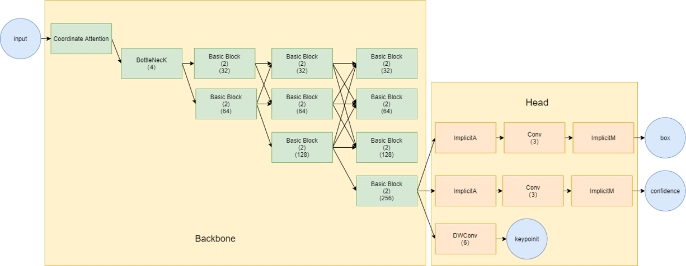
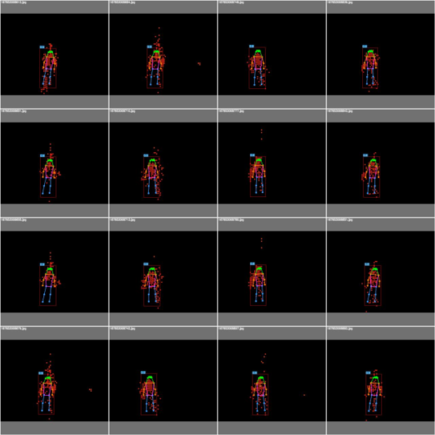

# CAttHRnetPose

Background: Human gesture detection based on radar cloud points.

Reference includes [High-revolutional Network](https://github.com/HRNet/HigherHRNet-Human-Pose-Estimation), [Yolov7](https://github.com/WongKinYiu/yolov7/tree/pose) and [Coordattention](https://github.com/houqb/CoordAttention?tab=readme-ov-file)

The structure of model:

Prediction look like:

